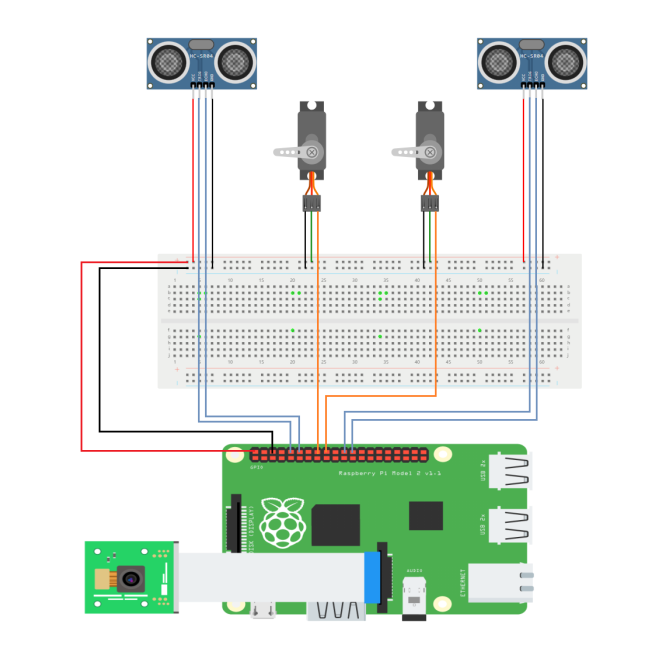

# ♻️ SmartBin AI – Intelligent Waste Sorting System

SmartBin AI is a complete intelligent system for **automated waste classification and management**, combining **Artificial Intelligence**, **embedded systems**, and **IoT-based alerts**. It classifies waste into 4 recyclable categories — **glass**, **metal**, **paper**, and **plastic** — and handles sorting and notification without human intervention.

This project was developed as part of our **final year engineering project (PFE)**.

---

## 🎯 Project Goals

- Automate the waste sorting process using image classification
- Reduce manual handling of waste
- Notify users when bins are full to improve efficiency
- Promote smart and sustainable technologies in environmental applications

---

## 🔁 System Workflow

The system follows these 4 main steps:

### 🖼️ Process Diagram



1. **Image Capture** via Raspberry Pi Camera  
2. **Waste Type Prediction** using an embedded MobileNet model  
3. **Bin Fill Level Detection** using ultrasonic sensors  
4. **Servo Control** to open the correct container  
   - **Case 1**: Open if the bin is not full  
   - **Case 2**: Prevent opening and send alert if the bin is full  

---

## ⚙️ Components Used

| Component              | Role                                                |
|------------------------|-----------------------------------------------------|
| **AI Model**           | MobileNet (pre-trained, fine-tuned for 4 classes)   |
| **Ultrasonic Sensors** | Measure bin fill level                              |
| **Servos**             | Move lid                                            |                          
| **Pi Camera**          | Capture waste image                                 |
| **Raspberry Pi**       | Main controller (model execution + hardware logic)  |

---

## 🧠 AI Model

- ✅ Model: **MobileNet** (pretrained on ImageNet, fine-tuned for waste)
- 🔁 Converted to **TensorFlow Lite** (`.tflite`) for Raspberry Pi inference
- 📂 Classes: `glass`, `metal`, `paper`, `plastic`
- 📁 Model training and evaluation available in [`model/modelfinal-tf.ipynb`](model/modelfinal-tf.ipynb)

---

## 📊 Dataset

Details in [`dataset/README.md`](Dataset/README.md)

---

## 🗃️ Project Structure

```bash
SmartBin-AI/
├── Dataset/           # Dataset structure and sample images
├── model/             # Training notebooks and exported models
├── raspberry-pi/      # Real-time control script for Raspberry Pi     
├── docs/              #  images (e.g., diagrams)
├── requirements.txt   # Python dependencies
└── README.md          
